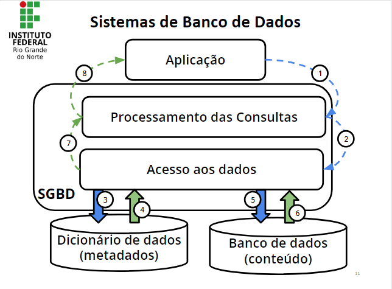

# 01 Conceitos de Banco de Dados

### Dados Versus Informação

| Dados | Informação |
| --- | --- |
| Fatos do mundo real que podem ser armazenados: | Fatos organizados de maneira a produzir um significado: |
| Data de Nascimento | Boletim escolar |
| Nome | Lista de alunos aprovados |
| Endereço | Lista de alunos por turma |
| CPF | Lista de aniversariantes do mês |
| Nota | Lista de clientes com seus números de CPF |

### Metadados

- Definimos Metadados como sendo “Dados sobre os dados”.
- Permitem efetuar a representação e identificação dos dados, garantindo sua consistência e persistência.
- Os Metadados são mantidos no Dicionário de Dados (ou em um catálogo de dados).

### Banco de Dados

Conjunto de dados relacionados gerenciado por um sistema (SGBD).

Um Banco de Dados (BD) é uma coleção organizada de dados. Esses dados são organizados de modo a modelar aspectos do mundo real, para que seja possível efetuar processamento que gere informações relevantes para os usuários a partir desses dados.

Um BD é composto por diversos objetos, tais como: tabelas, esquemas, visões, consultas, relatórios, procedimentos, triggers, entre outros.

Características de um Banco de Dados

- Os dados refletem um cenário de um domínio(contexto).
- A ordem dos dados é significativa, ou seja, o agrupamento de dados aleatoriamente(randomicamente) não caracteriza um banco de dados.
- Um banco de dados é projetado e implementado para um domínio específico.

Aplicações dos Bancos de Dados

Bancos de dados entram aplicações em inúmeras áreas, como:

- Sistema bancários
- Reservas em hotéis
- Controle de estoque em supermercados
- Youtube

- Catálogo de livros em bibliotecas
- E-commerce
- Receita Federal

Sistema Gerenciador de Banco de Dados (SGBD)

Conjunto de softwares que facilita a **definição, povoamento, manipulação** e o **compartilhamento** ao banco de dados, entre outras funcionalidades (ex, proteção e manutenção).

- Definição dos dados
    - Especificar os tipos de dados, as estruturas e suas restrições dos dados para armazenar
- Povoamento de base de dados
    - Processo de inserção dos dados no local de armazenamento
- Manipulação dos dados
    - Funções de pesquisa, atualização e relatório dos dados
- Compartilhamento
    - Controle do acesso dos usuários

Sistema de Banco de Dados

Características dos SGBDs

**Natureza autodescritiva** das bases de dados do sistema;

- O banco de dados armazena
    - os dados alvo do sistema
    - a definição dos dados
    - as restrições (de inserção, de atualização, de remoção, …) dos dados.

**Isolamento** entre os programas e os dados, e a abstração dos dados;

- Independência sistema-dados (abstração de dados)
- Os desenvolvedores dos sistemas precisam saber ou definir a representação (**modelo**) lógica dos dados

Suporte para **múltiplas visões** dos dados;

- Possibilita várias perspectivas (visões) dos dados
- Os dados visualizados são diretos ou derivados dos dados armazenados
    - Por exemplo, visão dos usuários e dos administradores

**Compartilhamento** de dados e processamento de transações de multiusuários.

- Possibilidade de acesso por múltiplos usuários
- Controle de concorrência (acesso controlado)
    - Por exemplo, compra de passagem aérea
- Gerenciamento de transações que são as consultas que possuem isolamento e atomicidade.

**Outros benefícios do SGBD**

- Controle de redundância
- Restrição de acesso não autorizado
- Garantia do armazenamento de estruturas para o processamento eficiente de consultas (ex. buffering)
- Garantia de backup e restauração
- Permite múltiplas interfaces para diferentes usuários
- Garantia das restrições de integridade