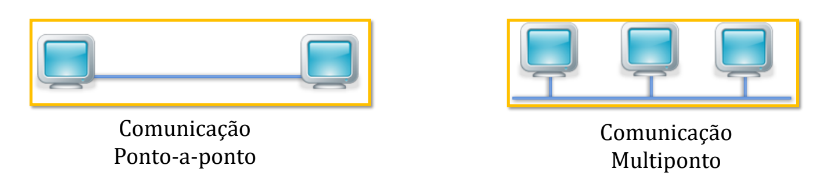

# Introdução às Redes de Computadores (29/08/23)

### Conceitos fundamentais / Comunicação de dados

### - Histórico

Antes da invenção das redes de computadores, a informação era transmitida de maneira física através de dispositivos de armazenamento como cartões perfurados e mídias magnéticas.

### Primeira Rede (1965)

A primeira conexão entre computadores em rede foi realizada em 1965 nos Estados Unidos por Thomas Merril e Lawrence Roberts.

Foi utilizada uma linha telefônica discada entre dois centros de pesquisa em Massachusetts e na Califórnia.

### Primeiros Sistemas Distribuídos(1968)

Utilização de um Mainframe interligando vários terminais menores que revezavam a sua utilização enviando comandos e recebendo os dados, criando assim um sistema multiusuário de tempo compartilhado.

### Criação da Ethernet

- Computadores ligados por cabos transmitindo e
recebendo bits de informações.
- Foi Criado por Robert Metcalfe e eram utilizados cabos
amarelos de espessura avantajada.

### - Comunicação de dados - Princípios Básicos

Ideia de Comunicação → É a transmissão de uma mensagem entre dois pontos ou mais indivíduos através de um meio físico qualquer.

Para que haja comunicação, são necessários basicamente 4 itens:

- Transmissor ou Emissor: Aquele que envia a mensagem.
- Receptor: Aquele que recebe a mensagem.
- Sinal: Mensagem a ser transmitida.
- Meio de transmissão: Interface entre o transmissor e o receptor.

### Como funciona a transmissão de informações entre computadores

Transmissão de sinais sob a forma de ondas eletromagnéticas, podendo ser:

- Guiados (par trançado, cabo coaxial, fibra óptica).
    - geralmente fibra óptica é utilizado para caminhos mais longos, e par trançado em conexões próximas, mas com o barateamento da tecnologia de fibra óptica isso vem sendo mudando.
- Não guiados (ar, vácuo)

> As ondas eletromagnéticas são ondas formadas pela
combinação dos campos magnético e elétrico que
se propagam no espaço perpendicularmente um em
relação ao outro e na direção de propagação da energia.
> 

Para haver a comunicação, deve existir primeiramente uma conectividade, que pode ser dos tipos:

- Ponto-a-ponto: Ligação entre dois dispositivos.
- Multiponto: Meio partilhado por mais de dois dispositivos.

### Modos de comunicação de dados

- Simplex:  Comunicação unidirecional (Tv, Radio);
- Half-duplex: Comunicação bidirecional alterada (Rádio de Polícia, Walk Talk);
- Full-duplex: Comunicação bidirecional simultânea (Telefone).

### -Ideia de Protocolo

Protocolo → Conjunto de regras que organizam a comunicação. É o que define a conexão entre as partes comunicantes, ditando as regras e definindo os meios de transmissão e os tipos de dados a serem trafegados.

Pode ser implementado pelo hardware, software ou ambos.

Existem vários protocolos que gerenciam as conexões de maneiras diferentes. Tipicamente, os protocolos:

- Estabelecem o handshaking (conexão entre as partes);
- Definem o início e o fim de uma mensagem;
- Definem o formato que esta mensagem deve estar para transitar na rede;
- Definem características específicas de uma conexão;
- Define quando uma conexão deve terminar;
- Define o que fazer com os sinais perdidos ou corrompidos.

### Alguns exemplos de Protocolos

- TCP → Transmission Control Protocol;
- IP → Internet Protocol;
- HTTP → Hypertext Transfer Protocol;
- FTP → File Transfer Protocol;
- SMTP → Simple Mail Transfer Protocol.

### Atividade de Fixação

- Explique o que é comunicação de dados e por que é importante no
contexto da tecnologia da informação.
    
    - A comunicação de dados é o compartilhamento de informações entre dois ou mais pontos.
    

- Descreva brevemente os três componentes principais de um
sistema de comunicação de dados e explique a função de cada um
deles.

- Diferencie os conceitos de "transmissão simplex", "transmissão
half-duplex" e "transmissão full-duplex" em relação à comunicação
de dados. Forneça exemplos de situações em que cada tipo de
transmissão é utilizado.