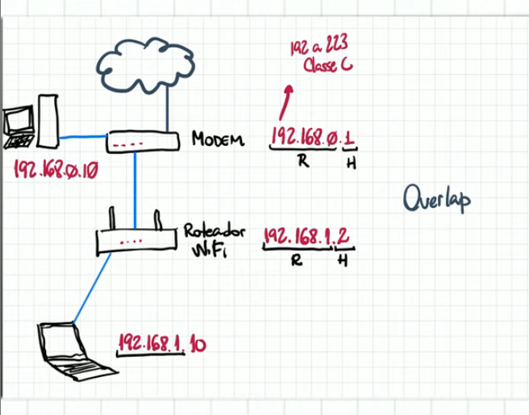

# Endereçamento IPV4

IP (Internet Protocol) é a identificação lógica dada aos computadores e dispositivos da rede. 

IPV4 → Utiliza números decimais, mas é representado em binário → 32 bits

ex.: 192.168.1.12    →   11000000.10101000.00000001.00001100

IPV6 → Utiliza números hexadecimal, mas é representado em binário → 128 bits

### Classes IPs

Usados pela internet 

Classe A    1° octeto entre 0 e 126   → 16.777.216 - 2 endereços de ip 

Classe B    1° octeto entre 128 e 191   → 65.536 - 2 endereços de ip 

Classe C    1° octeto entre 192 e 223   → 256 endereços de ip

Classe D    1° octeto entre 224 e 239   → Multicast 

Classe E    1° octeto entre 240 e 255   → Teste de novas tecnologias 

Usados de forma especial

- Unicast = um único aparelho
- Multicast = um grupo de vários aparelhos
- Broadcast = todos aparelhos da mesma rede
- Anycast = qualquer um que estiver perto

### IPs Restritos ou Privados e Reservados

**Endereços Privado** - São endereços usados em redes internas e não são roteáveis na Internet.

10.0.0.0/8 - rede interna

127.0.0.0/8 - loopback/localhost

255.255.255.255 - broadcast

172.16.0.0/12 - rede interna

169.254.0.0/16 - apipa

192.168.0.0/16  - rede interna

0.0.0.0 - ip de inicialização

**Endereço Público** - São endereços determinados pela InterNIC e consistem em identificação de rede com base na classe ou em blocos de endereços globalmente únicos na Internet.

### Componentes do Endereço IP

Classfull → Classificação das cinco classes dos endereços IP do
IPv4, ou seja, classe A, classe B, classe C, classe D e classe E.

Rede e Host

Rede seria como o DDD para determinar a região e o Host como o número de telefone, para determinar o dispositivo. 

Classe A :   120.200.15.2    Rede  Host → 16.777.214 endereços de ip 

Classe B :   147.218.30.1  Rede  Host →  65.534 endereços de ip 

Classe C :   192.168.0.1  Rede  Host →  254 endereços de ip

**Classless** - Esquema de endereçamento IPv4 que usa máscara
de subrede que não segue as regras de endereço utilizando a
classfull. Suporta VLMS (Variable Lenght Subnet Mask) e
supernet.

Redes privadas:

10.0.0.0/8 - rede interna

Protocolos (exemplo):
• RIP V2
• EIGRP
• OSPF

172.16.0.0/12 - rede interna

192.168.0.0/16  - rede interna

### Máscara de Redes

Redes classe A, B e C tem máscaras, serve para o aparelho identificar e determinar de qual Classe pertence o IP.

Classe A :   120.200.15.2    Rede  Host  Máscara →  225.0.0.0  

Classe B :   147.218.30.1  Rede  Host  Máscara→  255.255.0.0

Classe C :   192.168.0.1  Rede  Host  Máscara →   255.255.255.0

### Conversão de números binário

### Máscara CIDR - Classless Inter-domain Routing

Classe A

| Máscara Padrão | CIDR |
| --- | --- |
| 255.0.0.0 | 11111111 = 8 bits |
| 255.0.0.0 | /8 |

Classe B

| Máscara Padrão | CIDR |
| --- | --- |
| 255.255.0.0 | 8+8 = 16 bits |
| 255.255.0.0 | /16 |

Classe C

| Máscara Padrão | CIDR |
| --- | --- |
| 255.255.255.0 | 8+8+8 = 24 bits |
| 255.255.255.0 | /24 |

Máscara de Sub Rede

| Máscara Padrão | CIDR |
| --- | --- |
| 255.255.248.0 | 8+8+5 = 21 bits |
| 255.255.255.0 | /21 |

Valores de Máscaras de rede válidas: 255, 254, 252, 248, 240, 224, 192, 128, 0

### Endereçamento IP

Determinando Rede, Host e Broadcast Classe A 

Grupos IP

Rede → 1° Endereço possível dentro de uma rede.

Hosts → Atribuição ips a computadores.

Broadcast → Último endereço possível dentro de uma rede.

Classe A   →   10.10.100.1

| Rede | Host | Broadcast |
| --- | --- | --- |
| 10.0.0.0  +1 → | 10.0.0.1 até 10.255.255.254 | ← 1 - 10.255.255.255 |
|  |  |  |