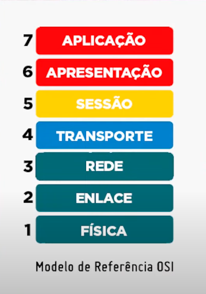

# Modelo ISO/OSI

### Aula 01 - Como surgiu o modelo OSI

Surgiu para definir um padrão para a criação de protocolo, equipamento, rede, para a comunicação entre diferentes redes.

Em 1971 foi idealizado o padrão, mas não desenvolvido.

Em 1973 foi criado a padronização TCP/IP. 

Em 1975 foi finalizado o modelo OSI.

### Camada de Aplicação

É a camada responsável pela integração do usuário com a rede, qualquer protocolo ou serviço que tenha contato direto pelo usuário, faz parte da camada de aplicação.

Protocolos presente nessa camada: 

- HTTP

- FTP

- DNS

- DHCP

- TFTP

### Camada de Apresentação

A camada que traduz os dados recebidos pelo usuário para uma linguagem entendida pela rede, emissor/receptor. Define a codificação, criptografia, semântica, sintaxe da mensagem enviada.

Codificações mais comuns: ASCII  ,  EBCDIC  , Criptografia = SSL e TLS.

A camada da o formato para o arquivo ex.: .txt .doc

### Camada de Sessão

É uma camada fim a fim (só tem acesso os dispositivos de origem e destino), responsável por estabelecer uma sessão de comunicação entre os dois pontos. Determina a hora de inicio, controle, e o final da transmissão.

Protocolo presente: 

- SIP (Section Initiate Protocol)

### Camada de Transporte

É a responsável por segmentar os dados para que possam ser enviados pela rede. Tornando possível a comunicação pela internet, pedaço por pedaço.

Podendo enviar os dados simultaneamente. 

### Camada de Rede

É a camada responsável por empacotar os dados segmentados na camada anterior. Estipula o endereçamento IPs, no qual identifica os pacotes para o envio dos dados de maneira correto. 

### Camada de Enlace

Serve para determinar a tecnologia em que os dados serão enviados. Se estiver usando Wi-Fi ele determina que será utilizado ondas de rádio para o envio, caso seja cabeado ele determina que é tecnologia Ethernet que fará o envio.

Quadro, é a separação física para os dados serem fisicamente enviados através da tecnologia determinada.

Endereço MAC, a identificação física presente na placa de rede do aparelho.

### Camada Física

Serve para transformar realmente todos os dados em algo físico, para a transmissão, pois é nela onde haverá os cabos, bits brutos (sinais elétricos enviados através dos cabos), conectores, repetidores de sinais e etc.

O modelo OSI possui três conceitos fundamentais

Interfaces: 

Protocolos:

Serviços: