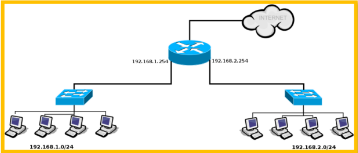

# 09 - Roteamento

Tarefa de encaminhar um pacote da origem ao destino utilizando dispositivos intermediários, chamados roteadores, que juntos compõem a rede de interconexão.

- O algoritmo de roteamento escolhe o caminho que um determinado pacote deverá seguir pela rede de interconexão;
- As tabelas de roteamento são mantidas com as informações sobre as rotas disponíveis;
- Um roteador possui pelo menos duas interfaces de rede, e cada interface conecta uma rede distinta;
- O algoritmo de roteamento seleciona uma determinada interface para encaminhar um pacote em função do endereço IP de destino contigo no cabeçalho do pacote;
- O gateway padrão ou default gateway representa o roteador que recebe todo o tráfego que seja endereçado para fora da LAN;
- Em redes que utilizam o esquema de endereçamento dinâmico, a informação sobre o gateway padrão é fornecida pelo servidor DHCP.

### Um roteador possui três funções básicas:

- Manutenção das informações de roteamento;
- Encaminhamento de pacotes;
- Serviços adicionais.

Os roteadores podem ser classificados em dois tipos:

- Especializados
- Não especializados

### Protocolo de Roteamento:

- Um protocolo de roteamento é um conjunto de regras e procedimentos que os roteadores utilizam para trocar informações e tomar decisões sobre como encaminhar pacotes de dados pela rede.
- Esses protocolos são usados para determinar as melhores rotas para direcionar o tráfego de rede de um ponto a outro.
- Exemplo: os protocolos RIP (Routing Information Protocol), OSPF (Open Shortest Path First) e BGP (Border Gateway Protocol), utilizam informações do cabeçalho do pacote IP, como endereço de destino, para realizar o processo de encaminhamento.
- É a parte do software da camada de rede responsável pela decisão sobre a interface de saída a ser usada na transmissão do pacote de entrada.

### Algoritmo de Roteamento

- Um algoritmo de roteamento deve oferecer algumas características básicas:
    - Selecionar o melhor caminho;
    - Convergir rapidamente;
    - Oferecer robustez;
    - Oferecer escalabilidade;
    - Consumir poucos recursos.

Selecionar o melhor caminho

- Escolha da melhor rota;
- O melhor caminho depende da métrica utilizada.
    - Exemplo: taxa de transmissão ou atraso.

Convergir rapidamente

- Adaptação rápida às mudanças (falhas em roteadores e canais de comunicação);
- Todos os roteadores tomam conhecimento das mudanças ocorridas através da troca de informações;
- A falta de uma rápida convergência pode provocar loops e falhas na rede.

Oferecer robustez

- Robustez significa funcionar corretamente, mesmo na presença de problemas (falha no hardware, falha no roteador ou excesso de tráfego na rede);
- Evitar bloqueios na rede (deadlock);
- Evitar que os pacotes fiquem vagando indefinitivamente (livelock).

Oferecer escalabilidade

- Desempenho compatível com o tamanho da rede;
- Adição de novos roteadores e de novas rotas deve ser uma tarefa automática, sem interrupção dos serviços.

Consumir poucos recursos

- Alocar pouca memória;
- Não fazer uso intensivo do processador dos roteadores;
- Consumir poucos recursos da rede de interconexão.

Os algoritmos de roteamento podem ser classificados conforme suas características de aplicação:

- Unicast, Multicast e Broadcast;
- Estático e Dinâmico;
- Plano e Hierárquico;
- Interno e Externo;
- Local e Global;
- Centralizado e Distribuído.

Unicast, Multicast e Broadcast;

- Roteamento Unicast, encaminhar o pacote para apenas um receptor.
- Roteamento Multicast, encaminhar o pacote para um grupo de receptores.
- Roteamento Unicast, encaminhar o pacote para todos os dispositivos da rede.

Estático e Dinâmico

- No algoritmo de roteamento estático ou determinístico as tabelas de roteamento são criadas e mantidas manualmente pelo administrador da rede;

- No algoritmo de roteamento dinâmico ou adaptativo as tabelas de roteamento são inicializadas e mantidas pelos próprios roteadores, a partir de informações periodicamente trocadas entre os dispositivos.

Plano e Hierárquico

- No roteamento plano todos os dispositivos estão no mesmo nível. A tabela de roteamento de cada roteador possui uma entrada para todos os outros roteadores da rede;
- No roteamento hierárquico os roteadores são agrupados logicamente em áreas, regiões, domínios ou sistemas autônomos. Permitem a criação de áreas administrativas com gerenciamento independente.

Interno e Externo

- Os algoritmos de roteamento interno são responsáveis apenas pelo roteamento dentro de uma mesma área (RIP e OSPF).
- Os algoritmos de roteamento externo são responsáveis apenas pelo roteamento entre diferentes áreas (BGP - Border Gateway Protocol).

Local e Global

- No algoritmo de roteamento local, os roteadores tomam as decisões de roteamento com base apenas em informações de seus vizinhos (RIP);
- No algoritmo de roteamento global, cada roteador tem o conhecimento completo do mapa da rede. Os roteadores trocam informações com todos os demais dispositivos, enviando o estado de enlace de cada vizinho (OSPF).

Centralizado e Distribuído

- No algoritmo de roteamento centralizado, a decisão de qual o caminho a ser seguido é tomada de forma centralizada, e geralmente calculada na origem (*source routing*);
- No algoritmo de roteamento distribuído, a decisão de qual caminho a ser seguido é tomada de forma distribuída, pelos roteadores que compõem a rede de interconexão, a medida que o pacote é encaminhado (RIP e OSPF).

### Métricas de Roteamento

São informações utilizadas pelos roteadores para selecionar o melhor caminho no envio de pacotes. Pode-se utilizar apenas uma métrica ou um conjunto de métricas combinadas.

- Número de saltos;
- Taxa de transmissão;
- Carga da rede;
- Atraso ou latência;
- Taxa de erro;
- Disponibilidade;
- Custo.

Número de saltos

Dispositivos intermediários que um pacote deve percorrer da origem até o destino. O melhor caminho é aquele com menus números de saltos (RIP).

Taxa de transmissão

Número de bits transmitidos por segundo (bps) pelos canais de comunicação que conectam os roteadores. O melhor caminho é aquele que possui a maior taxa de comunicação.

Carga de rede

- Identifica problemas de congestionamento por meio da utilização dos canais de comunicação.
- A carga de rede pode ser expressa de várias maneiras, incluindo:
    - Taxa de Utilização da Banda Larga
    - Número de Pacotes por Segundo (PPS - *Packets Per Second*)
    - Volume de Tráfego

Atraso ou Latência

- Representa o tempo necessário para que um pacote transmitido por um roteador alcance o dispositivo adjacente.
- Na maioria dos casos, são enviados vários pacotes e calculada uma média do RTT (*Round-Trip Time*).
- Aplicações como voz e vídeo são especialmente sensíveis ao atraso.

Taxa de erro

- A taxa de erro de um canal é a medida por meio da comparação entre o total de bits transmitidos e o número de bits recebidos com erro.
- Está relacionada ao tipo de meio de transmissão.

Disponibilidade

É o tempo que determinado canal de comunicação permanece em funcionamento de forma ininterrupta. O melhor caminho é aquele que oferece a maior disponibilidade. 

Custo 

- O custo é calculado por meio de uma combinação de diversas métricas que resultam em um valor.
- O melhor caminho é aquele que oferece o menor custo, ou seja, o menor valor resultante. Por exemplo: maior taxa de transmissão + menor atraso + menor taxa de erro + maior disponibilidade.

O protocolo EIGRP (Enhanced Interior Gateway Routing Protocol) da Cisco Systems utiliza quatro métricas para o cálculo do custo: taxa de transmissão, atraso, confiabilidade e carga de rede.